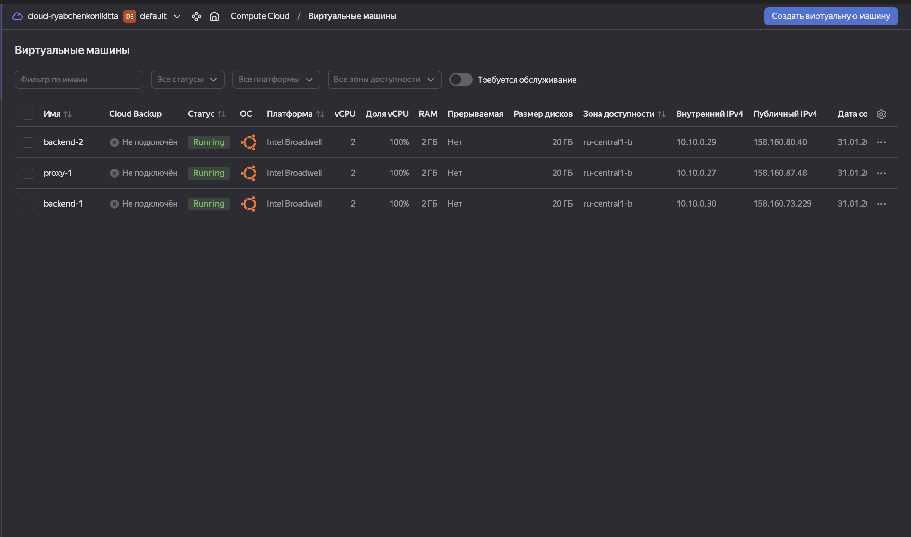
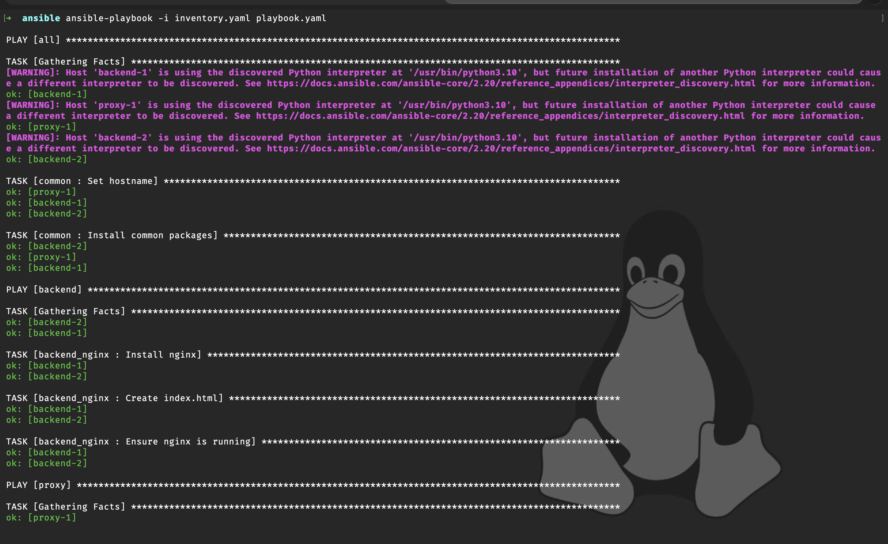
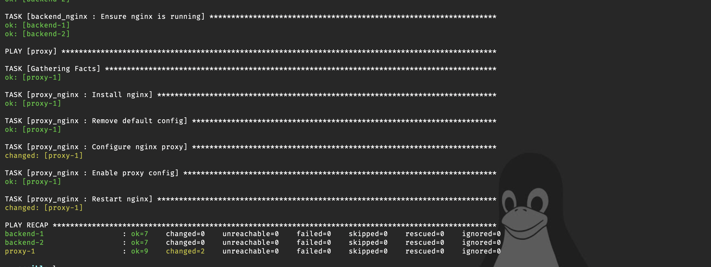

# Infra Lab — Terraform + Ansible

## Описание

Лабораторная работа по развёртыванию инфраструктуры в Yandex Cloud:

- 3 VM (proxy + 2 backend) через Terraform
- Настройка VM и сервисов через Ansible
- Nginx proxy на порту **3000**
- Backend Nginx с кастомной страницей  
  `Hello from <hostname>!`

---

## Структура репозитория

infra-lab/
├── terraform/
│   ├── main.tf
│   ├── variables.tf
│   ├── outputs.tf
│   └── terraform.tfvars
│
├── ansible/
│   ├── inventory.yaml
│   ├── playbook.yaml
│   └── roles/
│
└── screenshots/
    ├── vms.png
    ├── ansible1.png
    ├── ansible2.png
    ├── Nginx-proxy1.png
    └── Nginx-proxy2.png 

## 1. Виртуальные машины в Yandex Cloud

---

## 2. Выполнение Ansible playbook

---

## 3. Результат работы Nginx proxy (порт 3000)

